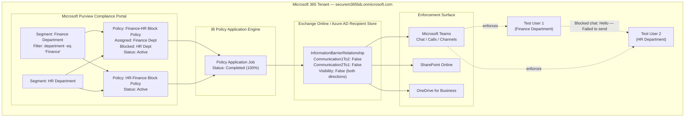

# Microsoft Purview Information Barriers — Finance ↔ HR Segregation


> Enterprise implementation of **Microsoft Purview Information Barriers (IB)** to enforce a compliance-driven ethical wall between the Finance and HR departments, blocking Teams chat/channel communication and SharePoint/OneDrive collaboration in both directions, with PowerShell-based verification and live Teams enforcement testing.

---

## Table of Contents

- [Project Overview](#project-overview)
- [Architecture Diagram](#architecture-diagram)
- [Prerequisites](#prerequisites)
- [Licensing Requirements](#licensing-requirements)
- [Microsoft 365 Components Used](#microsoft-365-components-used)
- [Implementation Flow](#implementation-flow)
- [PowerShell Verification](#powershell-verification)
- [Validation Summary](#validation-summary)
- [Case Study](#case-study)
- [Troubleshooting](#troubleshooting)
- [Known Limitations](#known-limitations)
- [Best Practices](#best-practices)
- [Lessons Learned](#lessons-learned)
- [Security Benefits](#security-benefits)
- [Business Benefits](#business-benefits)
- [Skills Demonstrated](#skills-demonstrated)
- [Certification Mapping](#certification-mapping)
- [Microsoft Learn References](#microsoft-learn-references)
- [Repository Structure](#repository-structure)
- [GitHub Topics](#github-topics)

---

## Project Overview

### Purpose

Demonstrate a production-representative configuration of **Microsoft Purview Information Barriers** to prevent two organizational segments (Finance and HR) from communicating or collaborating with each other across Microsoft Teams, SharePoint Online, and OneDrive for Business, in line with regulatory separation-of-duties and conflict-of-interest requirements.

### Business Scenario

Many regulated organizations (financial services, healthcare, legal, public sector) are required to prevent certain groups of employees from communicating with each other to avoid conflicts of interest, insider trading, or inappropriate access to sensitive personal/financial data. A common real-world example is preventing the **Finance** department from freely discussing compensation, layoffs, or investigations with **HR**, and vice versa, outside of formally sanctioned channels.

### Problem Statement

Without technical controls, any two Microsoft 365 users can freely chat, call, and share files in Teams and SharePoint/OneDrive regardless of department or role. Relying on policy and training alone does not prevent accidental or intentional information leakage between segregated business units.

### Solution Overview

Microsoft Purview Information Barriers were configured to:

1. Define two **segments** — `Finance Department` and `HR Department` — using attribute-based user group filters.
2. Create **two directional Information Barrier policies** (`Finance-HR Block Policy` and `HR-Finance Block Policy`) to enforce a **bidirectional block** between the two segments.
3. **Apply** the policies tenant-wide via the Purview policy application engine.
4. **Verify** the resulting relationship using the Exchange Online PowerShell module.
5. **Validate** real-world enforcement by attempting a Teams chat between a Finance-segment user and an HR-segment user.

---

## Architecture Diagram



See [`diagrams/Architecture.mmd`](diagrams/Architecture.mmd) for the standalone diagram source.

---

## Prerequisites

- Microsoft 365 tenant with Microsoft Purview compliance portal access
- Global Administrator or Compliance Administrator / IB Compliance Management role
- Exchange Online PowerShell module (`ExchangeOnlineManagement`) installed
- Test/pilot user accounts with a populated directory attribute (e.g., `Department`) usable as a segment filter
- Understanding of Exchange Online recipient attributes, since IB segments are built on Exchange/Azure AD attribute filters

## Licensing Requirements

Microsoft Purview Information Barriers require one of the following licenses assigned to users in scope:

- Microsoft 365 E5 / A5 / G5
- Microsoft 365 E5 / A5 / G5 Compliance add-on
- Microsoft 365 E5 / A5 / G5 Information Protection and Governance add-on
- Office 365 Advanced Compliance (legacy)

> Licensing was not captured in this lab's screenshots — the above reflects Microsoft's published licensing requirements for Information Barriers as of this documentation. Always confirm current requirements against the Microsoft 365 licensing guidance before production rollout.

## Microsoft 365 Components Used

### Microsoft Purview Components
- Information Barriers (Segments, Policies, Policy applications)
- Microsoft Purview compliance portal (`compliance.microsoft.com` / `purview.microsoft.com`)

### Exchange Online Components
- Exchange Online PowerShell (`ExchangeOnlineManagement` module)
- `Get-InformationBarrierRelationship` / `Get-EXOInformationBarrierRelationship` cmdlet
- Recipient attribute (`Department`) used as the segment filter condition

### Microsoft Teams Components
- Teams 1:1 chat enforcement (validated — blocked message)
- Teams channel and collaboration surfaces (governed by the same IB policy per Microsoft documentation; not independently re-tested in this lab beyond 1:1 chat)

---

## Implementation Flow

Every step below is backed by a screenshot in [`images/`](images/). No configuration is described that is not visible in the referenced image.

### Step 1 — Microsoft Purview Portal Overview

**Image:** `images/01-Microsoft-Purview-Information-Barriers-Overview.png`

The Microsoft Purview portal **Solutions** flyout menu, showing **Information Barriers** listed alongside other compliance solutions (Communication Compliance, Data Loss Prevention, Insider Risk Management, Information Protection, eDiscovery, etc.). This is the entry point used to navigate into the Information Barriers workload.

### Step 2 — Information Barriers Overview Page

**Image:** `images/02-Information-Barriers-Overview-Page.png`

The dedicated **Information Barriers** landing page inside Purview, showing the left navigation (**Overview**, **Segments**, **Policies**) and Microsoft's official documentation links. This confirms the Information Barriers solution is provisioned and accessible in the tenant.

### Step 3 — Segments Page (Empty State)

**Image:** `images/03-Information-Barriers-Segments-Page.png`

The **Segments** page prior to any configuration, showing **0 items** and a **New segment** action. Segments are the building blocks used to group users by attribute before they can be referenced in a policy.

### Step 4 — Create the Finance Segment (Name)

**Image:** `images/04-Create-Finance-Segment.png`

The **Create segment** wizard, Step 1 (Name). Segment name entered: **`Finance Department`**.

### Step 5 — Configure the Finance Segment Filter

**Image:** `images/05-Configure-Finance-Segment-Filter.png`

Step 2 (User group filter). A single condition was configured:

| Attribute | Operator | Value |
|---|---|---|
| Department | Equal | `Finance` |

### Step 6 — Review Finance Segment Configuration

**Image:** `images/06-Review-Finance-Segment-Configuration.png`

The wizard **Summary** screen, confirming the filter was compiled to the underlying query syntax:

```
department -eq 'Finance'
```

### Step 7 — Finance Segment Created

**Image:** `images/07-Finance-Segment-Created.png`

The **Segments** list now shows **Finance Department**, created by `admin365 lab` on `4 Jul 2026 04:54`.

### Step 8 — HR and Finance Segments Present

**Image:** `images/08-HR-and-Finance-Segments.png`

The **Segments** list now shows two segments: **HR Department** (last modified `4 Jul 2026 04:56`) and **Finance Department** (last modified `4 Jul 2026 04:54`).

> **Not configured in this lab:** the segment-creation wizard screens for the HR Department segment (Name / User group filter / Summary) were not captured. Based on the naming convention and the pattern used for the Finance segment, HR Department is assumed to use an equivalent `Department -eq 'HR'`-style filter, but this exact filter expression was not visually confirmed and should not be treated as verified fact.

### Step 9 — Information Barrier Policies Page (Empty State)

**Image:** `images/09-Information-Barrier-Policies.png`

The **Policies** page before any policy exists — **No data available**, with a **Create policy** action available.

### Step 10 — Create Information Barrier Policy (Name)

**Image:** `images/10-Create-Information-Barrier-Policy.png`

The **Create policy** wizard, Step 1 (Name). Policy name entered: **`Finance-HR Block Policy`**.

### Step 11 — Assign the Finance Segment to the Policy

**Image:** `images/11-Assign-Finance-Segment-to-Policy.png`

Step 2 (Assigned segment). The **Finance Department** segment was selected as the segment this policy governs.

### Step 12 — Configure Blocked Communication

**Image:** `images/12-Configure-Blocked-Communication.png`

Step 3 (Communication and collaboration). Configuration:

| Setting | Value |
|---|---|
| Communication and collaboration | **Blocked** |
| Segment blocked against | **HR Department** |
| Allow moderation | Unchecked (disabled) |

The portal note on this screen states: *"Communication over Teams and collaboration on SharePoint & OneDrive would be restricted based on this policy."*

### Step 13 — Enable the Policy

**Image:** `images/13-Enable-Information-Barrier-Policy.png`

Step 4 (Policy status). **Set your policy to active status** toggled **On**.

### Step 14 — Review the Policy Configuration

**Image:** `images/14-Review-Information-Barrier-Policy.png`

The wizard **Summary** screen confirming the full configuration before submission:

- **Name:** Finance-HR Block Policy
- **Assigned segment:** Finance Department
- **Blocked segments:** HR Department
- **Policy status:** Active
- **Allow moderation:** false

### Step 15 — Finance-HR Block Policy Created

**Image:** `images/15-Information-Barrier-Policy-Created.png`

The **Policies** list confirms **1 item**: **Finance-HR Block Policy**, Status **Active**, last modified `4 Jul 2026 05:03` by `admin365 lab`.

### Step 16 — Both Directional Policies Configured

**Image:** `images/16-Information-Barrier-Policies-Configured.png`

The **Policies** list now shows **2 items**:

| Name | Last Modified | Status |
|---|---|---|
| Finance-HR Block Policy | 4 Jul 2026 05:03 | Active |
| HR-Finance Block Policy | 6 Jul 2026 04:27 | Active |

> **Not configured in this lab:** the individual wizard screens for creating **HR-Finance Block Policy** were not captured. Its existence and Active status are confirmed by this screenshot, and its enforcement direction is independently confirmed by the bidirectional `Communication1To2`/`Communication2To1` values returned by PowerShell in Step 20. Its exact segment-assignment screens are not available as evidence.

### Step 17 — Policy Application In Progress

**Image:** `images/17-Information-Barrier-Policy-Application-In-Progress.png`

The **Policy application** page (`Policies > Policy applications`) showing an application job created and started at `07/06/2026 04:28:12`, Status **ApplyInProgress**, Progress **0**.

### Step 18 — Policy Application Pending Completion

**Image:** `images/18-Information-Barrier-Policy-Application-Pending-Completion.png`

The same job now shows Status **PendingCompletion**, Progress **100**.

### Step 19 — Policy Application Completed

**Image:** `images/19-Information-Barrier-Policy-Application-Completed.png`

The job reaches Status **Completed**, Progress **100**, with an **End time** of `07/06/2026 04:32:43` (approximately 4.5 minutes total processing time from start to completion).

### Step 20 — Verify the Information Barrier Relationship via PowerShell

**Image:** `images/20-Verify-Information-Barrier-Relationship-PowerShell.png`

From an elevated PowerShell session connected to Exchange Online, the following command was run:

```powershell
Get-EXOInformationBarrierRelationship -RecipientId1 "testuser1@securem365lsb.onmicrosoft.com" -RecipientId2 "testuser2@securem365lsb.onmicrosoft.com"
```

**Output (as captured):**

```
RecipientName1               : 50d96f8c-2028-42f2-b7b3-945fad73cc37
IBSegment1                   : adf86d19-5cac-4dcc-a139-fe3004d8d549
IBSegmentDisplayName1        : Finance Department
IBPolicy1                    : adf86d19-5cac-4dcc-a139-fe3004d8d549
IBPolicyDisplayName1         :
IBPolicyRecipientFilter1     : Finance Department
AddressListMembership1       : {}
HiddenFromAddressList1       :
RecipientName2               : 0ae8646a-d282-40cf-ad01-92e1ee1ef36c
IBSegment2                   : 88396deb-9338-4b46-b98a-ae4c15ffe6b5
IBSegmentDisplayName2        : HR Department
IBPolicy2                    : 88396deb-9338-4b46-b98a-ae4c15ffe6b5
IBPolicyDisplayName2         :
IBPolicyRecipientFilter2     : HR Department
AddressListMembership2       : {}
HiddenFromAddressList2       :
Visibility1To2               : False
Communication1To2            : False
Visibility2To1               : False
Communication2To1            : False
Identity                     :
IsValid                      : True
ObjectState                  : New
```

This output is definitive proof that:

- `testuser1` is correctly resolved into the **Finance Department** segment.
- `testuser2` is correctly resolved into the **HR Department** segment.
- Both **visibility** and **communication** are set to `False` **in both directions** (`1To2` and `2To1`), confirming the bidirectional block enforced by the two Active policies.
- `IsValid: True` confirms the relationship record is a coherent, policy-computed result (not an error state).

### Step 21 — Communication Verification Re-Check

**Image:** `images/21-Information-Barrier-Communication-Verification.png`

A second run of `Get-EXOInformationBarrierRelationship` against the same two recipients, returning an identical result set to Step 20. This re-verification confirms the relationship is stable and consistently enforced after the policy application job completed — not a one-time or transient state.

### Step 22 — Teams Chat Enforcement Validation

**Image:** `images/22-Information-Barrier-Teams-Chat-Restriction.png`

Real-world enforcement test in the Microsoft Teams client:

- Signed in as **Test User 1** (Finance Department segment).
- Opened a 1:1 chat with **Test User 2** (HR Department segment) — the chat existed in the chat list from before the barrier was applied.
- Typed and attempted to send the message **`Hello`**.
- Result: **"Failed to send."** displayed above the message bubble, with a red warning icon on the message itself.

This is the end-to-end proof point of the entire implementation: the Information Barrier policy, once applied, is actively enforced by the Teams client at the point of message send — not just reflected in the compliance portal or PowerShell output.

---

## PowerShell Verification

All PowerShell evidence in this lab was captured using the Exchange Online Management module against Exchange Online / Microsoft Purview. See [`scripts/`](scripts/) for reusable, parameterized versions of these checks.

```powershell
# Connect to Exchange Online (required for all IB cmdlets)
Connect-ExchangeOnline -UserPrincipalName admin@securem365lsb.onmicrosoft.com

# Verify the computed relationship between two specific recipients
Get-EXOInformationBarrierRelationship -RecipientId1 "testuser1@securem365lsb.onmicrosoft.com" -RecipientId2 "testuser2@securem365lsb.onmicrosoft.com"
```

Other cmdlets relevant to Information Barriers administration (standard Microsoft documentation — not independently executed/captured in this lab):

```powershell
# View all configured segments
Get-OrganizationSegment

# View all configured IB policies
Get-InformationBarrierPolicy

# Manually trigger policy application after creating/editing policies
Start-InformationBarrierPoliciesApplication

# Check the status of the most recent policy application job
Get-InformationBarrierPoliciesApplicationStatus
```

---

## Validation Summary

| Validation Point | Method | Evidence | Result |
|---|---|---|---|
| Segments created correctly | Purview portal | Images 07, 08 | Pass — Finance Department, HR Department both present |
| Policy configuration accurate | Purview portal wizard summary | Image 14 | Pass — Blocked, HR Department, Active, moderation off |
| Both directional policies Active | Purview portal | Image 16 | Pass — 2 Active policies |
| Policy application completed | Purview Policy applications page | Images 17–19 | Pass — Completed, 100% |
| Segment resolution correct | PowerShell `Get-EXOInformationBarrierRelationship` | Image 20 | Pass — correct segment mapping per user |
| Bidirectional block enforced | PowerShell (Communication1To2/2To1) | Images 20, 21 | Pass — both `False` |
| Real-world Teams enforcement | Live chat attempt | Image 22 | Pass — message failed to send |

---

## Case Study

### Executive Summary

This project implements and validates Microsoft Purview Information Barriers to create a compliance-enforced ethical wall between the Finance and HR departments in a Microsoft 365 tenant, blocking Teams communication and SharePoint/OneDrive collaboration in both directions, and independently verifying enforcement through both PowerShell and live client testing.

### Business Requirement

Organizations subject to conflict-of-interest, insider-trading, or data-segregation regulations often need a technical control — not just a policy document — that prevents specific departments or roles from communicating with each other inside Microsoft 365 collaboration tools. Finance and HR are a common real-world pairing due to the sensitivity of compensation, workforce actions, and financial reporting data each team handles.

### Implementation

Two attribute-based segments (Finance Department, HR Department) were created from the `Department` directory attribute. A pair of directional Information Barrier policies was created and set to **Blocked**/**Active**, and the Purview policy application engine was run to compile these into an enforceable relationship across the tenant.

### Validation

Validation was performed at three independent layers: the Purview portal (policy application job reaching **Completed/100%**), Exchange Online PowerShell (`Get-EXOInformationBarrierRelationship` returning `Communication1To2: False` and `Communication2To1: False`), and the Teams client itself (a real chat message between a Finance-segment user and an HR-segment user returning **"Failed to send"**).

### Challenges

Information Barrier policy application is **asynchronous** — the job in this lab took from `04:28:12` to `04:32:43` (roughly 4–5 minutes) to move from `ApplyInProgress` to `Completed`. Attempting to validate enforcement (Step 22) before the application job reaches `Completed` would have produced a false negative (block not yet enforced).

### Resolution

The `Policy applications` page was monitored to `Completed`/`100%` status before running PowerShell verification and the live Teams test, ensuring the validation results reflect the fully propagated policy state rather than a partially applied one.

### Outcome

All three validation layers were consistent: segment membership resolved correctly, the computed relationship showed a full bidirectional block, and the Teams client actively refused to deliver a message between the two segregated users. The control is confirmed to be enforced, not merely configured.

### Key Takeaways

- Information Barriers are attribute-driven — the accuracy of the underlying directory attribute (`Department`) directly determines segment accuracy, and by extension, policy accuracy.
- Bidirectional segregation requires **two** policies (one per direction), not one — a single policy only blocks the assigned segment's outbound communication toward the blocked segment.
- Policy application is asynchronous and must be confirmed as `Completed` before relying on the control or presenting it as enforced.
- PowerShell verification and live-client testing are complementary — the portal and PowerShell confirm *configuration*, while a real chat attempt confirms *enforcement*.

---

## Troubleshooting

See [`docs/Troubleshooting.md`](docs/Troubleshooting.md) for the full guide. Summary of issues directly relevant to this implementation:

| Symptom | Likely Cause | Resolution |
|---|---|---|
| Policy application stuck at `ApplyInProgress` | Application job still processing (this lab observed ~4–5 minutes) | Wait for `Completed` status before validating; do not assume failure prematurely |
| Users can still chat after policy created | Policy created/edited but application job not (re)run | Run `Start-InformationBarrierPoliciesApplication` or wait for the scheduled apply cycle |
| `Get-EXOInformationBarrierRelationship` returns unexpected segment | Directory attribute (`Department`) not populated or mismatched on the user object | Correct the attribute value in Azure AD / Exchange Online recipient properties, then re-apply |
| Teams still shows old chat history after block | Barriers block **new** communication; they do not retroactively delete prior chat history | Expected behavior — not a misconfiguration |

## Known Limitations

- Information Barriers govern **Teams chat/calls/channels and SharePoint/OneDrive** — they do not natively block Exchange email between segments (Exchange Online mail flow rules are a separate control, `Not configured in this lab`).
- Policy changes are not instantaneous; propagation time observed in this lab was ~4–5 minutes and may vary by tenant size in production.
- This lab validated a **single pair** of test users. Broader validation across all segment members, nested groups, and guest/external accounts was **not performed** in this lab.
- The exact directory attribute filter for the HR Department segment was not captured in evidence (see Step 8 note).

---

## Best Practices

See [`docs/Best-Practices.md`](docs/Best-Practices.md) for the full guide. Highlights:

- Always create **both directional policies** when a mutual (bidirectional) barrier is required.
- Pilot Information Barriers with a small, clearly labeled test segment (e.g., `Test User 1`, `Test User 2`) before rolling out to production department segments.
- Keep the directory attribute used for segmentation (e.g., `Department`) governed by a single authoritative source (HR system → Azure AD sync) to avoid segment drift.
- Always re-run and confirm `Get-InformationBarrierPoliciesApplicationStatus` (or check the Policy applications page) as `Completed` before communicating that a control is live.
- Document the exact segment filter query (as shown in the wizard Summary screen) for every segment — this is the definitive, auditable definition of segment membership.

## Lessons Learned

See [`docs/Lessons-Learned.md`](docs/Lessons-Learned.md) for the full write-up.

## Security Benefits

- Enforces a technical, auditable ethical wall rather than relying solely on administrative policy.
- Reduces insider-risk surface area between departments handling sensitive financial and personnel data.
- Provides PowerShell-queryable, exportable evidence of segregation (`Get-EXOInformationBarrierRelationship`) suitable for audit and compliance reporting.
- Complements Microsoft Purview Communication Compliance and Insider Risk Management as part of a layered Zero Trust data governance strategy.

## Business Benefits

- Supports regulatory compliance obligations (e.g., conflict-of-interest, insider-trading prevention) with demonstrable technical enforcement.
- Reduces reliance on manual monitoring or after-the-fact investigation of inappropriate cross-department communication.
- Enables organizations to safely use collaborative tools (Teams, SharePoint, OneDrive) across the whole company while still enforcing necessary internal segregation.

## Skills Demonstrated

- Microsoft Purview compliance portal administration
- Information Barriers segment and policy design (attribute-based filtering)
- Exchange Online PowerShell (`ExchangeOnlineManagement` module)
- Asynchronous policy application monitoring and troubleshooting
- End-to-end control validation methodology (config → apply → PowerShell verify → live enforcement test)
- Technical documentation and evidence-based GitHub portfolio authoring

---

## Certification Mapping

| Exam | Relevance |
|---|---|
| **SC-400**: Microsoft Information Protection Administrator | Core exam objective — Information Barriers is a named topic under "Implement information protection" / data governance controls |
| **SC-300**: Microsoft Identity and Access Administrator | Relevant to segment design, since IB segments rely on Azure AD / Exchange Online directory attributes and identity governance |
| **MS-102**: Microsoft 365 Administrator | Relevant to overall Microsoft 365 compliance portal administration and licensing prerequisites for Purview solutions |

## Microsoft Learn References

- [Learn about information barriers](https://learn.microsoft.com/en-us/purview/information-barriers)
- [Define policies for information barriers](https://learn.microsoft.com/en-us/purview/information-barriers-policies)
- [Information barriers cmdlets (Exchange Online PowerShell)](https://learn.microsoft.com/en-us/powershell/module/exchange/information-barrier-cmdlets)
- [Information barriers in Microsoft Teams](https://learn.microsoft.com/en-us/microsoftteams/information-barriers-in-teams)
- [Information barriers in SharePoint and OneDrive](https://learn.microsoft.com/en-us/sharepoint/information-barriers-sharepoint)

---

## Repository Structure

```
Project-16-Microsoft-Information-Barriers/
│
├── README.md
├── LICENSE
├── CHANGELOG.md
├── CONTRIBUTING.md
├── SECURITY.md
│
├── docs/
│   ├── Architecture.md
│   ├── Implementation-Guide.md
│   ├── Validation.md
│   ├── Troubleshooting.md
│   ├── Lessons-Learned.md
│   ├── Best-Practices.md
│   └── References.md
│
├── scripts/
│   ├── Connect-ExchangeOnline.ps1
│   ├── Verify-InformationBarrier.ps1
│   └── Validate-IBRelationship.ps1
│
├── images/
│   └── (22 screenshots, 01–22, referenced throughout this README)
│
└── diagrams/
    ├── Architecture.mmd
    ├── Workflow.mmd
    └── PolicyFlow.mmd
```

## GitHub Topics

```
microsoft-purview  information-barriers  microsoft-365  exchange-online
microsoft-teams  compliance  data-governance  powershell
zero-trust  information-protection  sc-400  m365-security
insider-risk  data-security  purview-compliance
```

---

*Documentation authored as part of a Microsoft 365 / Purview enterprise infrastructure portfolio. All configuration steps and outputs are sourced directly from lab screenshots and PowerShell console captures — no configuration in this document was fabricated or assumed beyond what is explicitly noted.*


## Disclaimer

This repository documents a Microsoft 365 / Microsoft Purview lab configuration for portfolio and educational purposes. Screenshots and PowerShell output reference a non-production, sandbox tenant (securem365lsb.onmicrosoft.com) and test accounts only. No production customer data, credentials, or secrets are included in this repository.
