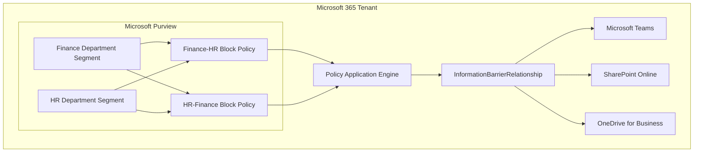
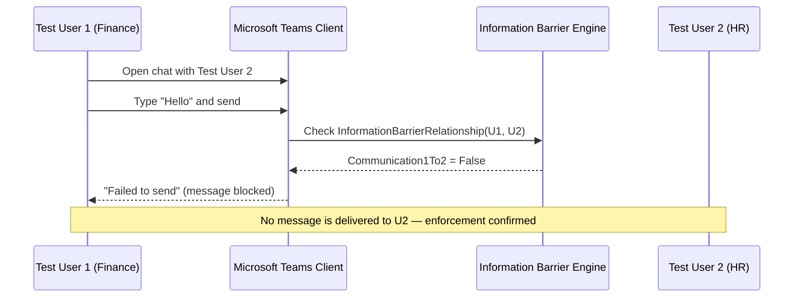

# Architecture — Microsoft Purview Information Barriers

## Purpose

Describe the logical architecture of the Information Barriers control implemented in this project: how segments, policies, the policy application engine, and enforcement surfaces (Teams, SharePoint, OneDrive) relate to each other in Microsoft 365.

## Component Model

| Component | Role | Evidence |
|---|---|---|
| **Segment** | A named group of users computed from a directory attribute filter | `images/04`–`08` |
| **Policy** | Binds an assigned segment to one or more blocked segments, with a communication mode (Blocked/Allowed) | `images/10`–`16` |
| **Policy Application Engine** | Asynchronous Purview job that compiles active policies into enforceable relationships across the tenant | `images/17`–`19` |
| **InformationBarrierRelationship** | The computed, per-recipient-pair record read by Teams/SharePoint/OneDrive at enforcement time | `images/20`, `21` |
| **Enforcement Surface** | Teams (chat/calls/channels), SharePoint Online, OneDrive for Business — the actual points where communication/collaboration is allowed or blocked | `images/22` (Teams validated) |

## High-Level Architecture Diagram

See [`../diagrams/Architecture.mmd`](../diagrams/Architecture.mmd).

## Communication Flow (Sequence)

## Configuration Verification

Only the following were directly observed in this lab and are treated as verified fact:

- Two segments exist: `Finance Department`, `HR Department`.
- Two Active policies exist: `Finance-HR Block Policy`, `HR-Finance Block Policy`.
- A policy application job reached `Completed` status at 100% progress.
- `Get-EXOInformationBarrierRelationship` confirms bidirectional block (`Communication1To2: False`, `Communication2To1: False`).
- A live Teams chat message between the two segments failed to send.

## Security Notes

- Information Barriers operate at the **identity/relationship** layer, independent of Conditional Access or network controls — they should be considered a data governance control, not a network security control.
- Segment accuracy is entirely dependent on the correctness of the underlying directory attribute (`Department` in this lab). Attribute governance (source-of-truth, HR-to-AD sync accuracy) is a prerequisite, not an afterthought.
- Policy application is asynchronous; architecture diagrams and any "as of" enforcement claims should always reference the **policy application job status**, not just policy `Active` status.
